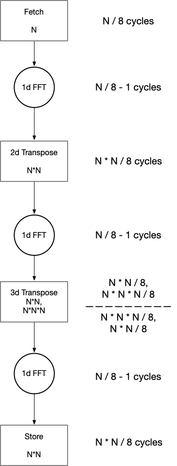

# Modelling Latency of 3D FFT

1. Kernel execution latency
2. PCIe Latency to transfer data between Host CPU's main memory to DDR Memory of the FPGA board.

## Kernel Execution

Single lane kernel pipeline:

### 2D Transpose

2d transposition requires $`\frac{N^2}{8}`$ cycles to buffer N$`^2`$ points and another $`\frac{N^2}{8}`$ to output them. This is because the pipeline processes 8 complex single precision floating points in every stage of the pipeline. This stage, however, adds only a latency of $`\frac{N^2}{8}`$ cycles; besides the first write to the buffer every other stage is overlapping with others.

### 3D Transpose

3d transpose is not pipelined therefore has 2 distinct read and write phases, denoted by the dashes. Additional 2d transpositions are required as intermediate buffers before storing and loading from the 3d buffer that adds further $`\frac{N^2}{8}`$ cycles of latency each.

### Total Latency

The total latency in cycles, can therefore, be expressed using the following equations:

Assuming a clock frequency of 300 MHz, the pipeline latency can be estimated to be approximately:

|  N$`^3`$  | Latency$`_{singlelane}`$(ms) |
|:-----:|:-----------------------:|
| 32^3  | 0.029                   |
| 64^3  | 0.226                   |
| 128^3 | 1.776                   |
| 256^3 | 14.09                   |

### PCIe Latency

This can be modelled as (incomplete):

| # SP Points | PCIe Est (ms) | PCIe Write (ms) Measured | PCIe Read (ms) Measured |
|:-----------:|:-------------:|:---------------------------:|:--------------------------:|
|     32^3    |     0.031     |            0.105            |            0.110           |
|     64^3    |     0.253     |             0.44            |            0.43            |
|    128^3    |      2.03     |             2.75            |            2.75            |
|    256^3    |     16.24     |             21.3            |            21.3            |
|    512^3    |     129.9     |                             |                            |

SP = complex single precision floating point

PCIe Latency is measured by timing the blocking `clEnqueueWriteBuffer ` and `clEnqueueReadBuffer` calls over an average of 1000 iterations.

### SVM Data Transfer Latency

| # SP Points | SVM latency (ms) | BW (GB) |
|:-----------:|:--------:|:-------:|
|     32^3    |   0.110  |  4.766  |
|     64^3    |   0.227  |  18.47  |
|    128^3    |   1.60   |  20.97  |
|    256^3    |   12.62  |  21.27  |
|    512^3    |   98.71  |  21.75  |

SP points is the number of complex single precision points that are transferred using SVM from host to FPGA.

SVM latency (ms) measures the time taken to transfer data back and forth. The experiment performs an N-point 1d FFT N$`^2`$ times, thereby requiring N$`^3`$ data. The read, FFT and writes are perfectly overlapping that it estimates the data transfer latencies. The delay is measured by timing the clEnqueueTask() calls for an average of 1000 iterations.

Bandwidth (GB) is the bidirectional bandwidth obtained from latency and twice the data sent.

### DDR Memory access and transfer latency

Latency to acces DDR4 operating at 2400 MT/s incurs a latency of 240 cycles. (incomplete).
